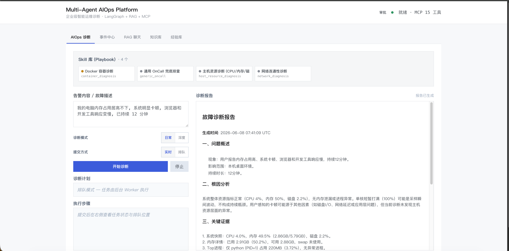
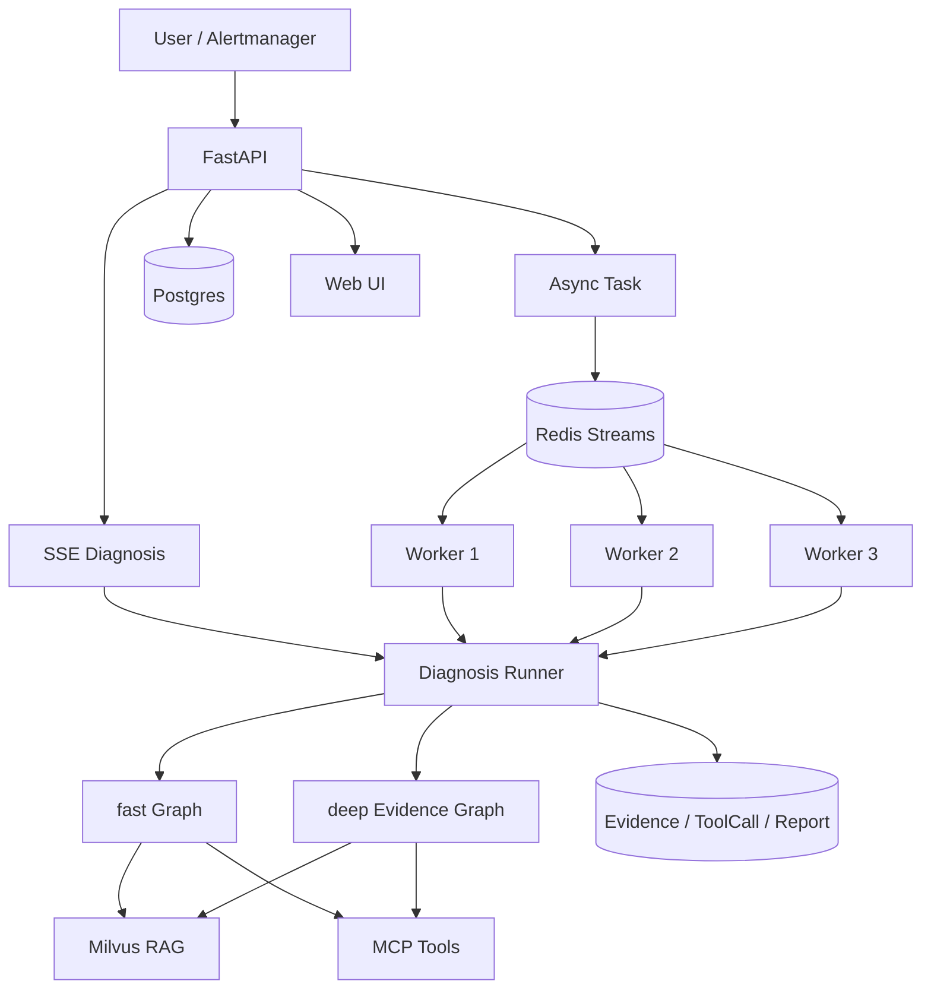

# Multi-Agent AIOps Platform

面向 OnCall / SRE 场景的多智能体智能运维诊断平台。系统接收故障描述或 Alertmanager 告警，结合 Skill、RAG 知识库与 MCP 工具完成证据采集、根因分析、处置建议和诊断报告生成。




## 核心能力

- **双诊断模式**：`fast` 使用 Plan-Execute-Replan 快速闭环，`deep` 使用多 Agent 证据图处理复杂 RCA。
- **Skill-first 路由**：先匹配排障 Playbook，再限制可用工具和上下文，降低误调用与无效检索。
- **混合 RAG**：Parent-Child chunking、Vector + BM25 双路召回、RRF 融合与本地 reranker。
- **统一工具接入**：系统、网络、Docker、Web Search、Windows 日志等能力通过 MCP 服务暴露。
- **后台任务系统**：Redis Streams 提供优先级队列，独立 Worker 执行长耗时诊断。
- **事实与审计**：Postgres 保存告警、事件组、任务、AgentRun、ToolCall、Evidence 和报告。
- **并发保护**：支持接口限流、分布式执行槽、Worker 心跳、pending 回收、重试和死信队列。
- **经验沉淀**：诊断结果可整理为 Markdown Wiki，并在后续诊断中重新召回。
- **评测与压测**：包含检索评测、RAGAS / OpenEvals 数据集以及队列和接口压测脚本。

## 系统架构



### fast 模式

适用于目标明确、需要快速闭环的常规故障：

```text
Skill Router
    -> Planner
    -> Executor
    -> Replanner
    -> Report
```

### deep 模式

适用于需要跨指标、日志、基础设施和 SOP 交叉验证的复杂故障：

```text
IncidentManager
    -> CorrelationContext
    -> EvidencePlan
    -> MetricAgent / LogAgent / InfraAgent / RunbookAgent
    -> EvidenceReducer
    -> RCAJudge
    -> RemediationPlanner
    -> ReportAgent
```

各专业 Agent 只读取自己的 scoped 输入和工具白名单，并将压缩后的 Evidence 写回共享状态。Reducer 负责去重和评分，RCAJudge 基于结构化证据排序候选根因。

## 内置 Skill

| Skill | 场景 | 主要工具范围 |
|---|---|---|
| `host_resource_diagnosis` | CPU、内存、磁盘、OOM、主机卡顿 | 系统快照、进程、磁盘、知识库 |
| `network_diagnosis` | DNS、HTTP、端口、连通性异常 | DNS、HTTP、端口、Ping、Web Search |
| `container_diagnosis` | 容器退出、重启循环、资源异常 | Docker 状态、日志、inspect |
| `generic_oncall` | 现象不明确或多组件复合故障 | 通用只读工具集合 |

## 技术栈

| 层级 | 组件 |
|---|---|
| API / UI | FastAPI、SSE、原生 Web UI |
| Agent 编排 | LangGraph、LangChain |
| 模型接入 | OpenAI-compatible API、可选本地模型 |
| 检索 | Milvus、BM25、RRF、BGE reranker |
| 任务队列 | Redis Streams |
| 事实库 | PostgreSQL |
| 工具协议 | MCP |
| 部署 | Docker Compose、Shell、PowerShell |

## 快速开始

### 环境要求

- Python 3.11+
- Docker 与 Docker Compose
- 至少一个可用的 OpenAI-compatible Chat 模型 API Key
- 使用默认本地 embedding 配置时，需要 Ollama 和 `bge-m3`

### 1. 安装依赖

```bash
git clone <repository-url>
cd <repository-directory>

python -m venv .venv
source .venv/bin/activate
pip install -r requirements.txt

cp .env.example .env
```

Windows PowerShell 激活虚拟环境：

```powershell
.\.venv\Scripts\Activate.ps1
Copy-Item .env.example .env
```

### 2. 配置环境变量

编辑 `.env`，至少填写一个 Chat 模型 API Key，并替换知识库管理令牌：

```env
DEEPSEEK_API_KEY=<your-api-key>
# 或 DASHSCOPE_API_KEY=<your-api-key>

KB_ADMIN_TOKEN=<strong-random-token>
```

默认 embedding 提供方为 Ollama：

```bash
ollama pull bge-m3
```

也可在 `.env` 中调整 `EMBEDDING_PROVIDER`、模型名称、向量维度和服务地址。

### 3. 选择启动方式

#### 方式 A：Docker Compose 全量启动

```bash
docker compose --profile app up -d --build
docker compose ps
```

该方式会启动 API、3 个 Worker、MCP 服务、Milvus、Redis、Postgres 和本地 Web Search 服务。

查看日志或停止服务：

```bash
docker compose logs -f api worker-1
docker compose --profile app down
```

#### 方式 B：本地 Python 进程 + Docker 基础设施

macOS / Linux：

```bash
bash scripts/run_all.sh
```

脚本会启动基础设施、本地 MCP 服务、API 和 3 个 Worker。进程 PID 写入 `.run/`，日志写入 `logs/`。

```bash
tail -f logs/api.log logs/worker-1.log
bash scripts/stop_all.sh
bash scripts/stop_all.sh --infra
```

Windows：

```powershell
powershell -NoProfile -ExecutionPolicy Bypass -File .\run.ps1
```

### 4. 导入知识库

确保 Milvus 已启动，再执行：

```bash
python scripts/ingest_kb_corpus.py --dry-run
python scripts/ingest_kb_corpus.py --reset
```

## 访问入口

| 服务 | 地址 |
|---|---|
| Web UI | <http://localhost:9900> |
| Swagger UI | <http://localhost:9900/docs> |
| ReDoc | <http://localhost:9900/redoc> |
| 健康检查 | <http://localhost:9900/api/v1/health> |
| 就绪检查 | <http://localhost:9900/api/v1/health/ready> |
| 队列状态 | <http://localhost:9900/api/v1/queue/status> |
| Attu | <http://localhost:8000> |

## API 概览

| 功能 | 方法 | 路径 |
|---|---|---|
| SSE 诊断 | `POST` | `/api/v1/aiops/diagnose` |
| 提交后台诊断 | `POST` | `/api/v1/aiops/diagnose/submit` |
| 任务列表 | `GET` | `/api/v1/incidents/tasks` |
| 任务详情 | `GET` | `/api/v1/incidents/tasks/{task_id}` |
| 队列状态 | `GET` | `/api/v1/queue/status` |
| Alertmanager Webhook | `POST` | `/api/v1/webhook/alertmanager` |
| RAG Chat | `POST` | `/api/v1/chat/stream` |
| Skill 列表 | `GET` | `/api/v1/skills` |
| 上传知识库文档 | `POST` | `/api/v1/documents/upload` |
| 文档列表 | `GET` | `/api/v1/documents` |
| 删除文档 | `DELETE` | `/api/v1/documents/{source}` |
| Wiki 概览 | `GET` | `/api/v1/wiki/overview` |
| 评测报告 | `GET` | `/api/v1/eval/reports` |

知识库写操作需要请求头：

```http
X-KB-Admin-Token: <your-admin-token>
```

完整请求与响应模型以 Swagger UI 为准。

## 使用示例

提交一个后台诊断任务：

```bash
curl -X POST http://localhost:9900/api/v1/aiops/diagnose/submit \
  -H 'Content-Type: application/json' \
  -d '{"query":"Redis 连接数接近 maxclients，接口开始超时","mode":"deep"}'
```

模拟告警：

```bash
python scripts/mock_alert.py --scenario redis
python scripts/mock_alert.py --list-history
```

执行压测：

```bash
python scripts/loadtest.py submit --n 100 --concurrency 20
python scripts/loadtest.py webhook --n 500 --concurrency 100
```

## RAG 与评测

检索链路：

```text
Markdown / SOP / Alert Corpus
    -> Hierarchical Split
    -> Parent-Child Chunking
    -> Milvus Vector Recall + BM25 Recall
    -> RRF Fusion
    -> Local Rerank
    -> Top-k Parent Context
```

仓库提供：

- `benchmark/retrieval_rk_50.jsonl`：50 条检索评测集
- `benchmark/ragas_qa_50.jsonl`：50 条端到端问答评测集
- `benchmark/run_benchmark.py`：统一评测入口
- `scripts/eval_ragas.py`：RAGAS / OpenEvals 评测
- `benchmark/reports/`：历史结果样例
- `docs/PRESSURE_TEST_REPORT.md`：并发压测结果
- `docs/CONCURRENCY_TEST_GUIDE.md`：并发验证方法

历史结果只代表对应数据、模型、依赖和运行环境，不应直接视为其他环境的性能承诺。

## 项目结构

```text
.
├── app/                    # FastAPI、Agent、RAG、队列与事实库
├── benchmark/              # 评测集、评测脚本和报告
├── data/kb_corpus/         # 知识库语料
├── data/wiki/              # Wiki 约定与运行时目录
├── docs/                   # SOP、并发测试与压测文档
├── frontend/               # Web UI
├── mcp_servers/            # MCP 工具服务
├── open-webSearch-main/    # 本地 Web Search 服务
├── scripts/                # 启动、导入、评测和压测脚本
├── docker-compose.yml
├── Dockerfile
├── requirements.txt
└── run.ps1
```

## 配置要点

配置集中在 `.env`，常用分组包括：

- Chat 模型：`DEEPSEEK_*`、`DASHSCOPE_*`、`AGENT_*_MODEL`
- Embedding：`EMBEDDING_PROVIDER`、`OLLAMA_*`、`DASHSCOPE_EMBEDDING_*`
- 存储：`MILVUS_*`、`REDIS_URL`、`DATABASE_URL`
- RAG：`RAG_*`
- 队列与 Worker：`DIAGNOSIS_TASK_*`、`*_DIAGNOSIS_CONCURRENCY`
- MCP：`MCP_*_URL`
- 权限控制：`PERMISSION_MODE`、`GUARDRAILS_BLOCK_HIGH_RISK_TOOLS`
- 日志：`LOG_LEVEL`、`LOG_DIR`、`LOG_RETENTION_DAYS`

生产部署前应替换示例密码和管理令牌，并按部署环境配置网络访问、持久卷、备份和资源限制。

## 数据与提交边界

以下内容已通过 `.gitignore` 排除，不应提交到仓库：

- `.env` 与本地密钥
- Python / Node 虚拟环境和依赖目录
- 日志、缓存、覆盖率和临时文件
- Docker 数据卷与本地数据库状态
- 运行时生成的 Wiki 内容

提交前可执行：

```bash
git status --short
git ls-files | grep -E '(^|/)\.env$|\.(pem|key)$' && exit 1 || true
```

## License

项目代码使用 [MIT License](LICENSE)。仓库内集成的第三方组件和语料可能适用各自的许可证；重新分发时应同时保留对应目录中的许可证与声明。
